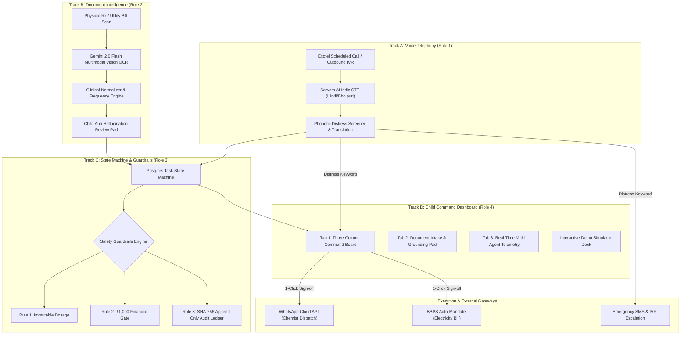
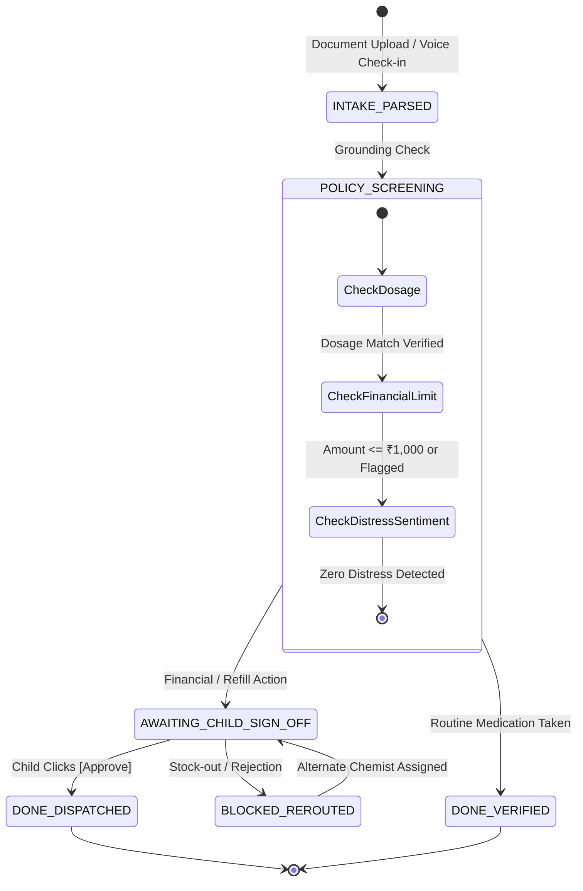

# SaharaSetu / Sahay AI (सहाय)
> **Autonomous Eldercare Logistics & Indic Telephony Command System**  
> *Bridging Metro Children & Hometown Elderly Parents through Indic Voice AI, Multimodal Vision OCR, and Guardrailed Execution.*

---

## 🌟 1. Executive Summary & Problem Context
Across India, millions of adult children migrate to Tier-1 metropolitan centers (Bengaluru, Mumbai, NCR) for career opportunities, while their aging parents live back in hometowns (e.g., Patna, Gaya, Varanasi, Lucknow). 

### The Core Challenges:
1. **Elderly Usability Gap:** Elderly parents struggle with complex smartphone applications. They rely strictly on regular phone calls in regional languages (Hindi, Bhojpuri, Maithili, Kannada).
2. **Medication & Utility Logistics:** Routine prescription refills, LPG cylinder bookings, and electricity payments require regular physical coordination with local vendors.
3. **Emergency Blind Spots:** Missed morning check-ins or acute distress symptoms (*"Bahut tez dard ho raha hai"*) often go unnoticed by children living hundreds of kilometers away.

**Sahay AI (सहाय)** solves this by orchestrating a multi-agent system:
- **For Parents:** Transparent, automated voice calls in their native Indic dialect via Sarvam AI & Exotel.
- **For Children:** A high-polish Linear/Stripe-aesthetic web command dashboard providing complete visibility, anti-hallucination verification gates, and 1-click execution.

---

## 🏗️ 2. System Architecture & End-to-End Flow



---

## 🧩 3. The 4 Engineering Tracks

### 🎙️ Track A (Role 1): Voice Agent & Conversational Design
- **Indic Telephony Pipeline:** Outbound scheduled calls via Exotel with Sarvam AI STT & TTS across Hindi, Bhojpuri, and Maithili.
- **Phonetic Sentiment & Keyword Screening:** Real-time screening for emergency distress tokens (*"चक्कर"*, *"साँस फूल रही है"*, *"बहुत दर्द"*).
- **Escalation Logic:** Automatic escalation to emergency contacts after 3 unanswered rings.

### 📄 Track B (Role 2): Document Intelligence & Vision OCR
- **Multimodal Extraction:** Live Gemini 2.0 Flash multimodal Vision OCR (`src/services/geminiVision.ts`) with an in-browser Tesseract.js fallback, plus a grounded offline engine so the demo never hard-fails. Grounding coordinates are zero-hallucination normalized bounding boxes.
- **Three Document Classes:** `PRESCRIPTION`, `ELECTRICITY_BILL` / `UTILITY_BILL`, and `PENSION_CERTIFICATE` (EPFO life-certificate intimation — the "pension life certificate before the November deadline" case from the problem statement).
- **Clinical Normalizer (`src/utils/clinicalNormalizer.ts`):** Normalizes Latin frequencies (`OD`, `BD`, `TDS`, `HS`, `SOS`, `QWK`, `MONTHLY`, `ONE_OFF`) into concrete reminder slots (`08:00 AM`, `08:30 PM`, `30-Nov of Every Year`). `Once Daily (Evening)` is matched ahead of the generic `OD` rule so an evening dose is never silently rescheduled to the morning.
- **Extraction Diff (`src/utils/extractionDiff.ts`):** Every item carries an immutable `extracted` snapshot of what the OCR engine read. The Document Intake screen shows *extracted vs. child-confirmed* per field, with per-field revert, a "revert all to OCR" action, and an immutable record of the diff written to the audit ledger on approval. Strength overrides are flagged separately because the agent must never be the party that changes a dosage.
- **Honest Confidence (Task 2.4):** A missing or out-of-range OCR score is recorded as `0.0` and forced into `needs_review` rather than being defaulted to a flattering number. Any item below the `0.60` clinical gate cannot auto-activate.
- **Anti-Hallucination Gate:** Extracted schedules remain strictly in pre-activation status until confirmed by the child.
- **Sample Documents & Tests (Tasks 0.7 / 2.6):** `ocr_service/samples/` holds the three required sample documents (prescription, electricity bill, pension letter), regenerable via `ocr_service/make_samples.py`. `ocr_service/test_ocr.py` runs the real pipeline over them, so Task 3.4t is a repeatable command.

### ⚙️ Track C (Role 3): Backend Orchestration & Guardrails
- **Deterministic State Transitions:** `PENDING` &rarr; `AWAITING_APPROVAL` &rarr; `DONE` / `BLOCKED`.
- **₹1,000 Financial Threshold Gate:** Any financial order or bill exceeding ₹1,000 is locked for manual child sign-off.
- **Cryptographic Audit Immutability:** Every log event is linked via a sequence number and `SHA-256` hash chain (`sequence | eventType | actor | timestamp | prevHash`).

### 💻 Track D (Role 4): Frontend Command Dashboard & Demo Polish
- **Tab 1 (Command Board):** Tri-column board (*Done & Verified*, *Needs Your Approval*, *Couldn't Complete*), localized parent profile switching, and audio-visual celebratory chimes.
- **Tab 2 (Document Intake):** Dual-mode intake (drag-and-drop live image preview with OCR overlays + quick presets for instant grounding).
- **Tab 3 (Multi-Agent Trace):** Dark-mode observability console displaying node latencies, payload inspector, and tamper-evident append-only event stream.
- **Offline Reliability:** Direct fallback to `src/data/mockData.ts` with 0 console 502 errors when backend is unreachable.

### 📁 Project Structure & Documentation
- `docs/schema.json` — Shared task contract & state definitions.
- `docs/demo_scenario.md` — Locked live stage demo scenario.
- `src/` — Track D: React/Vite Frontend Command Dashboard.
- `backend/` — Track C: Node/Express & PostgreSQL Backend Engine.
- `voice-agent/` — Track A: Outbound Voice Agent & STT/TTS caller pipeline.

---

## 🛡️ 4. Safety Guardrail Invariants

| Guardrail Rule | Target Risk | Enforcement Mechanism |
| :--- | :--- | :--- |
| **Rule #1: Immutable Dosages** | LLM Hallucination | Extracted medication molecules and strengths are locked to source OCR bounding boxes and require child review. A child strength override is surfaced as a safety event in the audit ledger rather than applied silently. |
| **Rule #2: ₹1,000 Financial Gate** | Unauthorized Debits | Any transaction exceeding **₹1,000** mandates explicit dashboard authorization. |
| **Rule #3: Distress Escalation** | Undetected Medical Emergencies | Detected distress phrases trigger the top alert drawer, high-priority audio chime, and push notifications. |
| **Rule #4: Audit Immutability** | Audit Tampering | Append-only SHA-256 hash chain records actor (`child_dashboard`, `sarvam_telephony`, `guardrail_engine`) for every state transition. |

---

## 🚦 5. Task State Machine Lifecycle



---

## ⚡ 6. Getting Started & Local Development

### Prerequisites:
- Node.js `18.x` or `20.x`
- npm `9.x`+

### Installation & Run:
```bash
# 1. Clone repository
git clone https://github.com/zaidali01/SaharaSetu.git
cd SaharaSetu

# 2. Install dependencies
npm install

# 3. (Optional) Configure Gemini Vision API Key for live multimodal extraction
# Create a .env file in root:
# VITE_GEMINI_API_KEY="AIzaSy..."

# 4. Start local development server
npm run dev
```
Open `http://localhost:5173` in your browser.

### Production Build Verification:
```bash
npm run build
```

---

## 🎯 7. Live Stage Demo Cheat Sheet

| Feature / Scenario | How to Demonstrate |
| :--- | :--- |
| **Switch Parent Context** | Click the parent profile avatar in the top navbar &rarr; select **Shanti Devi (Gaya)** or **Prof. B. K. Jha (Patna)**. Notice instant vendor and dialect updates. |
| **Document Intake & OCR** | Switch to **Tab 2** &rarr; Drop any prescription image. Watch the 1.2s scanner animation load the real image preview, bounding boxes, and pre-activation table. |
| **Schedule Activation** | Click **[Approve & Activate Schedule]** &rarr; triggers confetti celebration, chime, and navigates directly to Tab 1. |
| **Simulate Voice Scenarios** | Click the floating **⚡ Demo Controls** dock at the bottom right: <br>&bull; *Simulate Morning Call (Verified)*<br>&bull; *Simulate Missed Call (Escalated)*<br>&bull; *Simulate Distress Alert (Chest Pain)* |
| **Inspect Audit Trace** | Switch to **Tab 3** or click **Audit Trace** on any card &rarr; view cryptographic SHA-256 signatures, sequence numbers, and telemetry logs. |

---

## 👥 Contributors & Team
- **Track A (Voice Telephony & Indic Conversational Design)**
- **Track B (Document Intelligence & Multimodal Vision OCR)**
- **Track C (Backend Architecture, Postgres State Engine & Guardrails)**
- **Track D (Frontend Command Dashboard & Demo Polish)**

